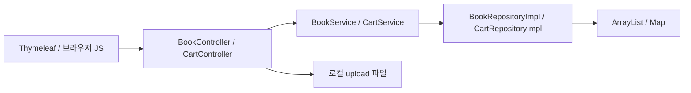

# BookMarket

Thymeleaf에서 도서 목록·상세·등록을 보고, HTTP session ID로 장바구니를 구분하는 Spring MVC 실습.

## 도서와 장바구니

- 목록·ID 상세·category·matrix-variable filter를 조회한다.
- 도서 등록은 Bean Validation과 커스텀 validator를 거치고 multipart 이미지를 로컬 파일에 저장한다.
- 장바구니 추가·삭제는 세션 ID를 key로 처리하고 BigDecimal로 합계를 계산한다.
- Spring Security form login으로 `/books/add`를 ADMIN에 제한한다.



repository 데이터는 프로세스 메모리에 있고 재시작 후 유지되지 않는다. JDBC/MySQL 의존성과 datasource 설정은 있지만 현재 repository에서 DB 쿼리를 실행하지 않는다. 주문·결제·회원 DB는 구현되어 있지 않다.

## 실행 조건

JDK 21을 사용한다. `application.properties`의 context path는 `/BookMarket`, 파일 upload는 `D:/upload/`, datasource는 localhost:3306/bookmarket을 가리킨다. 메모리 repository여도 JDBC starter의 datasource 자동 설정 때문에 DB 연결 조건을 확인해야 한다. 현재 설정과 같은 MySQL 계정/연결 환경이 없는 상태를 성공 실행으로 보지 않는다.

저장소 루트에서:

```bash
cd BookMarket
bash gradlew bootRun
```

기본 주소는 localhost:8080/BookMarket/home이다. Spring Security의 실습 계정은 `SecurityConfig`에 있다. 도서 등록·다운로드는 Windows upload 경로와 파일 쓰기 권한을 확인한다. 별도의 `.env` loader는 없고 값은 properties와 Java 코드에 있다.

```bash
bash gradlew test
```

기존 test는 `src/test/`에서 확인한다. 본 문서 정비에서는 외부 DB를 붙여 실행하거나 build 설정을 변경하지 않았다.

## 구조와 요청

`controller`는 페이지·JSON·파일 응답, `service`는 중간 호출, `repository`는 현재 메모리 저장, `domain`은 Book/Cart/CartItem, `validator`는 도서 입력 검사다. `templates`와 `static/js/controller.js`는 화면과 장바구니 요청을 잇는다.

실제 method가 일반 REST 관례와 다른 경로도 있다. 예를 들어 `PUT /cart/{cartId}`는 수정이 아니라 조회한다. [HTTP/API 계약](docs/API.md)에 입력·응답·인증을 코드대로 정리했다.
